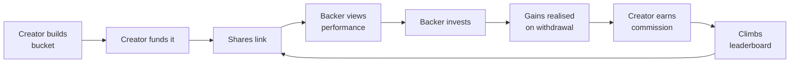
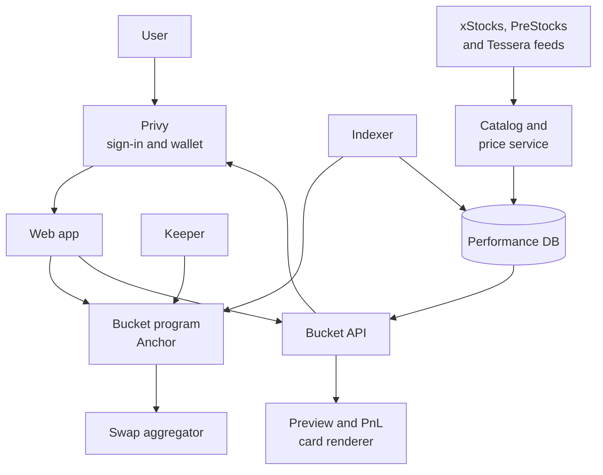

# Bucket — Product Spec

21 Sept 2026 · Oghenekparobor

## Summary

Bucket lets anyone bundle tokenized stocks into a named, weighted basket, put money into it in one tap, and earn a commission when other people invest through it and make gains.

A bucket is a public recipe: a list of stocks and their weights. The creator funds it first. Anyone with the link can see how it has performed, back it with their own money, and leave at any time. A leaderboard ranks buckets by return, so good pickers get found and paid.

Bucket runs on Solana with tokenized public stocks from xStocks and pre-IPO company tokens from PreStocks and Tessera, is non-custodial, and prices everything in USD. People sign in with email, Google, Apple or X through Privy and get a self-custodial wallet automatically. It is entirely separate from Glance, and it makes everyone a portfolio manager.



The loop is self-feeding: performance earns ranking, ranking earns backers, backers earn the creator commission.

## Problem and opportunity

People with a good investing thesis have no way to package it, prove it, or get paid for it. People without a thesis either buy a generic index or copy stock tips from strangers with no track record.

- **Pickers** post ideas on X, Discord and newsletters that nobody can verify, and followers who profit pay them nothing. On Bucket, followers who profit pay the picker 20% of the profit, and pickers can share a PnL card of their bucket's growth on socials or save it as a picture.
- **Followers** cannot act on a multi-stock idea in one step. On Bucket they buy someone's whole bucket in one step and get notified when the picker changes their mind.
- **Funds** solve both, but need custodians, minimums and a fund vehicle. On-chain, each backer holds their own tokens, so none of that is needed. Licensing is covered under risks.
- **The minimum investment is $1**, so anyone can start.

Tokenized stocks on Solana remove the plumbing problem. A basket is just a list of token mints and weights, swaps settle in seconds for cents, and every position is verifiable on-chain. That makes a track record something a program can compute rather than something a person claims.

## Goals and non-goals

### Goals

1. A creator can go from idea to a funded, shareable bucket in under 3 minutes.
2. A visitor arriving from a share link can understand the bucket and invest in under 2 minutes, with no wallet extension and one confirmation.
3. Every performance number shown is computed from on-chain data and is the same for everyone who looks.
4. Creators are paid only when their backers make money, and backers can always see exactly what they paid.
5. A creator can never withdraw, move or redirect a backer's money.

### Non-goals for v1

| Not doing | Why |
| --- | --- |
| Pooled fund with shared ownership | Each backer holds their own tokens. Keeps custody simple and avoids a fund structure. |
| Non-stock assets (SOL, memecoins, LP tokens) | Bucket is about companies, public and pre-IPO. A curated catalog also limits manipulation. |
| Building our own on-ramp or KYC | Card and bank funding come through Privy's funding providers, who run their own checks. Bucket only ever handles USDC. |
| Private or invite-only buckets | Public performance is the product. Private buckets weaken the leaderboard. |
| Leverage, shorting, options | Long-only keeps risk legible for backers and the fee model simple. |
| Social feed, comments, DMs | Distribution happens on X and chat apps through the share link. |

## Personas and core concepts

### Who uses it

| Persona | Who they are | What they want |
| --- | --- | --- |
| Creator | Has a thesis and an audience: a finance creator, an analyst, a sharp friend in a group chat | A verifiable track record, distribution, and income from being right |
| Backer | Has money and trust in a creator, but no time or confidence to pick stocks | One-tap exposure to someone else's thesis, with clear fees and a clean exit |
| Visitor | Arrives from a share link and is not signed in | Enough proof to decide whether to connect and invest |

A person can be all three. Every creator is also the first backer of their own bucket.

### Core concepts

| Concept | Definition |
| --- | --- |
| Bucket | A public recipe: name, thesis, 2 to 15 tokens from the catalog, public or pre-IPO, and a weight for each that sums to 100%. Stored on-chain. |
| Version | Each edit creates a new version of the recipe. Old versions stay visible forever. |
| Position | One backer's holdings in one bucket. The tokens sit in an account only that backer can withdraw from. |
| Unit price | The bucket's index value. Starts at $100 on creation and moves with the weighted prices of its stocks. Deposits and withdrawals do not move it. |
| Total backed | Current USD value of all positions in the bucket, including the creator's. |
| Commission | A flat 20% of a backer's realised gains, paid to the creator on withdrawal. |
| Sync | Rebalancing a position so it matches the bucket's latest version. |

The key design choice is that a bucket is a recipe, not a pool. Backers mirror the recipe inside their own position, so the creator steers the allocation but never holds the money.

## User stories

### Creator

- As a creator, I want to search stocks and set a weight for each so that my bucket reflects my thesis exactly.
- As a creator, I want to fund my own bucket at creation so that backers can see I have money at risk.
- As a creator, I want to share a PnL card of my bucket's growth so that my results spread on socials.
- As a creator, I want to edit holdings and weights so that the bucket follows my thinking as it changes.
- As a creator, I want a link and a preview card so that I can share the bucket anywhere my audience is.
- As a creator, I want a dashboard of backers, total backed and commission earned so that I know what is working.
- As a creator, I want to close a bucket to new money so that I can retire a thesis without deleting its record.

### Backer

- As a backer, I want to see return, drawdown, holdings and edit history before investing so that I can judge the creator on facts.
- As a backer, I want to invest from as little as $1 in one step so that I do not place an order per stock.
- As a backer, I want to see the 20% commission and an example in dollars before I confirm so that fees never surprise me.
- As a backer, I want to choose whether edits apply to my position automatically so that I control how much I delegate.
- As a backer, I want to be notified when a creator proposes an edit, before it takes effect, so that I can exit if I disagree.
- As a backer, I want to withdraw part or all of my position to USDC at any time so that I am never locked in.
- As a backer, I want a portfolio view across all buckets I hold so that I see my total value, gains and fees paid.
- As a backer, I want to share or save a PnL card of my gains so that I can show my result and bring friends in.

### Visitor

- As a visitor, I want to open a bucket link without signing in so that I can evaluate before committing to anything.
- As a visitor, I want to browse the leaderboard by period so that I can find creators worth backing.
- As a visitor, I want to open a creator's profile so that I can see all their buckets, including the ones that lost money.

## Requirements

P0 is the smallest product where the full loop works: create, fund, share, back, measure, rank, pay.

### P0: Sign in and wallet

Privy handles sign-in and user wallets, so a first-time user needs no extension, no seed phrase and no SOL.

- [ ] Sign in with email, Google, Apple or X through Privy, or with an external Solana wallet such as Phantom, Solflare or Backpack
- [ ] A first sign-in by email or social creates a self-custodial Solana wallet automatically
- [ ] Browsing buckets, the leaderboard and profiles needs no sign-in. Sign-in is asked for only to create, invest or make a PnL card
- [ ] "Add funds" offers a deposit address with QR code, a transfer from an external wallet, and card or bank purchase of USDC through Privy's funding providers where available
- [ ] Every transaction is confirmed in an in-app sheet that states the action and the amount in USD
- [ ] Bucket sponsors network fees and fronts account rent in SOL, charging the rent back in USDC, so the user never needs to hold SOL
- [ ] A user can export their wallet key from settings at any time
- [ ] A user can link X, and a linked handle shows as verified on their buckets and profile
- [ ] A user who signed in with a wallet can add an email for notifications

### P0: Asset catalog

Buckets are built from one catalog that merges three Solana token issuers, so a creator can mix public stocks with pre-IPO companies such as SpaceX, OpenAI, Anthropic and Anduril.

| Source | What the token is | Feed |
| --- | --- | --- |
| xStocks | Tokenized public stocks and ETFs | xStocks token list, priced on-chain |
| [PreStocks](https://prestocks.com/api/prestocks) | Pre-IPO tokens backed 1:1 by SPV exposure to the private company. 8 companies as of 21 Sept 2026 | `prestocks.com/api/prestocks`: symbol, mint, token price, mark price, implied valuation, supply |
| [Tessera](https://docs.tessera.pe/) | T-Tokens: pre-IPO exposure structured as loan participation rights, tradable on Solana DEXs | `rest-api.tessera.pe/v1/public/token-details` |

- [ ] The catalog merges all three sources into one searchable list. Each entry carries ticker, company, mint, source, asset type (public stock, ETF or pre-IPO) and live on-chain price
- [ ] Catalog sync pulls every source at least hourly. A token that disappears from its source is flagged for review and blocked from new buckets, never silently dropped from existing ones
- [ ] Every token shows its source and a pre-IPO label in the builder, on the bucket page and on the confirmation screen
- [ ] Pre-IPO tokens show both the on-chain token price and the issuer's mark price, because the two can sit far apart. On 21 Sept 2026 the SpaceX PreStocks token traded near $119 against a mark near $154
- [ ] Unit price, returns and commission always use the on-chain token price, since that is what backers actually trade at
- [ ] Only tokens above the liquidity floor can be added. Each pre-IPO token is capped at 25% of a bucket, against 50% for public stocks
- [ ] A bucket holding pre-IPO tokens states on its confirmation screen that these are not shares: PreStocks are SPV-backed exposure and Tessera tokens are loan participation rights

### P0: Create a bucket

The creator names the bucket, writes a thesis of up to 280 characters, picks 2 to 15 stocks from the curated catalog, and sets weights.

- [ ] Stock search returns results by ticker or company name with live price
- [ ] Weights are whole percentages, each between 2% and 50%, or 25% for a pre-IPO token, and must sum to 100% before the creator can continue
- [ ] An "equal weight" action splits 100% evenly across the chosen stocks
- [ ] Commission is fixed at 20% of backers' realised gains on every bucket. The creator does not set it
- [ ] Creator must deposit at least $25 of their own money in the same flow. A bucket with no creator money cannot be published
- [ ] Publishing writes the recipe on-chain and returns a share link
- [ ] A wallet can own at most 5 active public buckets

### P0: Invest in a bucket

- [ ] Backer enters a USD amount, minimum $1, funded from USDC in their Bucket wallet or a connected external wallet
- [ ] The confirmation screen shows the split per stock, estimated swap cost, the 20% commission, a dollar example of the commission on a 20% gain, and the refundable account rent
- [ ] One confirmation funds the position. Swaps then execute per stock and the position shows "filling" until all legs complete
- [ ] If a leg fails, exceeds 1% slippage, or is below the minimum swap size, that slice stays as USDC in the position and is retried or filled on the next top-up. The backer can see and withdraw it at any time
- [ ] Top-ups to an existing position follow the same flow and use the current version's weights

**Account rent.** The backer pays the rent for the token accounts their position needs: about 0.002 SOL per stock, once per position. It is charged in USDC out of the deposit, shown as its own line before confirmation, and kept out of cost basis and commission. It is refunded when the position is fully closed. Top-ups pay rent only for stocks the position does not already hold, and when an edit adds a stock, the rent for the new account comes out of the position at sync. Creators pay rent the same way for their bucket and their own position.

### P0: Withdraw

- [ ] Backer can withdraw any percentage of a position to USDC at any time, with no lock-up and no exit fee other than commission on gains
- [ ] The withdrawal screen shows proceeds, realised gain, commission, and net amount before confirmation
- [ ] Commission is deducted in the same transaction that pays the backer
- [ ] Withdrawal works even if the bucket is closed, the creator is inactive, or the Bucket web app is offline

### P0: Edit a bucket

- [ ] Creator can add stocks, remove stocks and change weights, under the same rules as creation
- [ ] Each edit creates a new version with a timestamp and an optional note of up to 140 characters
- [ ] An edit takes effect 24 hours after it is submitted. During that window the bucket page shows the pending change to everyone
- [ ] At most one edit per 7 days
- [ ] At backing time the backer chooses "apply edits automatically" or "ask me first". Default is automatic
- [ ] Automatic positions are synced by a keeper after the edit takes effect. "Ask me first" positions show a one-tap sync prompt and otherwise stay as they are
- [ ] Every backer is notified when an edit is proposed and again when it takes effect: in the app, and by email or Telegram if they have added one
- [ ] Name and thesis are editable. Performance history is never editable or resettable

### P0: Performance

- [ ] Every bucket page shows unit price chart, return over 7 days, 30 days, 90 days and since creation, max drawdown, total backed, number of backers, and bucket age
- [ ] Holdings table shows each stock, target weight, and its contribution to return
- [ ] Version history lists every edit with before and after weights
- [ ] A backer sees their own position separately: amount invested, current value, gain in USD and percent, and commission that would be due if they withdrew now

### P0: Leaderboard

- [ ] Ranks public buckets by return for a chosen period: 7 days, 30 days, 90 days, all time. Default is 30 days
- [ ] Each row shows rank, bucket name, creator, return, max drawdown, total backed, and backers
- [ ] Only eligible buckets are ranked. Eligibility rules are in the methodology section
- [ ] Updates at least once per hour

### P0: Share link

- [ ] Every bucket has a permanent URL of the form `bucket.xyz/b/<slug>`
- [ ] The page is fully readable without signing in
- [ ] The link renders a preview card on X, WhatsApp, Telegram and iMessage showing name, creator, 30-day return and top 3 holdings
- [ ] A share button copies the link and offers native share on mobile
- [ ] A creator or backer can generate a PnL card for a bucket showing bucket name, creator, period, percent return, and a QR code and short link back to the bucket
- [ ] The PnL card can be saved as an image or shared straight to X, WhatsApp and Telegram. A backer's card shows percent gain by default, and dollar amounts only if they switch them on

### P1: fast follows

- Creator profile page with all buckets, combined total backed, and lifetime record, including closed buckets
- Creator dashboard: backers over time, commission earned, link clicks to deposits
- Notifications for completed syncs and commission paid
- Solana Blinks so a backer can invest from inside an X post
- Recurring deposits, weekly or monthly
- Risk-adjusted leaderboard tab
- Referral attribution so a non-creator who shares a link earns a slice of platform fees

### P2: design for, do not build

- Periodic commission settlement for backers who never withdraw
- Buckets that hold other buckets

## Commission model

Commission is a share of a backer's realised profit, charged only when they withdraw and only if they are up. No management fee, no entry fee to the creator, no fee on losses.

### Rules

1. Commission is a flat 20% of realised gains on every bucket. Creators cannot change it.
2. Each position tracks its cost basis: total USDC deposited, reduced proportionally on each withdrawal.
3. On a withdrawal of a fraction of the position, the gain is the USDC proceeds minus the same fraction of cost basis.
4. If the gain is positive, commission is 20% of the gain. If it is zero or negative, commission is zero.
5. Commission is measured on actual proceeds after swap costs, so creators are paid on what the backer really made.
6. The platform keeps 20% of each commission. The creator receives 80%, claimable in USDC at any time.
7. The creator pays no commission on their own position.
8. Commission already paid is not refunded if the rest of the position later falls.

```latex
\text{commission} = 0.20 \times \max\left(0,\; P - f \times B\right)
```

Here P is the USDC proceeds, f the fraction withdrawn, and B the position's cost basis before the withdrawal.

### Worked example

| Step | Position value | Cost basis | Proceeds | Gain | Commission | Creator gets | Platform gets | Backer receives |
| --- | --- | --- | --- | --- | --- | --- | --- | --- |
| Deposit $1,000 | $1,000 | $1,000 | | | | | | |
| Bucket rises 25% | $1,250 | $1,000 | | | | | | |
| Withdraw 40% | $750 | $600 | $500 | $100 | $20 | $16 | $4 | $480 |
| Bucket falls 28% | $540 | $600 | | | | | | |
| Withdraw the rest | $0 | $0 | $540 | -$60 | $0 | $0 | $0 | $540 |

### Platform revenue

Two lines, both proposals to confirm: the 20% share of commissions above, and a 0.20% fee on the USD value of deposits and withdrawals. The second line means the platform earns even in flat markets, when commissions are zero.

## Performance and leaderboard methodology

A bucket's performance is the return of its recipe, not of the money in it. This keeps the number identical for every viewer and immune to deposits and withdrawals.

### Unit price

- Starts at $100 when the bucket is published.
- Recomputed at least hourly from the active version's weights and each token's on-chain price.
- When an edit takes effect, the new weights apply from that moment. The unit price carries on from its last value, so an edit never resets or jumps the chart.
- A backer's personal return can differ slightly from the bucket's because of swap costs, entry time and sync timing. Both numbers are always shown separately.

### Leaderboard eligibility

| Rule | Threshold | Guards against |
| --- | --- | --- |
| Bucket age | At least 14 days, and at least as old as the period being ranked | Lucky new buckets topping the board |
| Creator's own money | At least $25 held continuously | Zero-risk paper portfolios |
| Holdings | Every token above a minimum liquidity in the catalog | Returns that nobody could actually have traded |
| Active buckets per wallet | 5 | Spraying many buckets and promoting the winner |
| Status | Public and open | Closed buckets stay on profiles, not on the board |

### Anti-gaming

- **Edit front-running.** A creator could buy a thin stock, add it to a bucket, and sell into backers' automatic buys. The 24-hour public delay, the liquidity floor, the 50% weight cap and the 7-day edit limit each reduce the payoff.
- **Survivorship.** Creator profiles show every bucket a wallet has made, including closed and losing ones. P1 adds a combined record per creator.
- **Sybil creators.** Wallet limits are easy to dodge with new wallets. The $25 stake and 14-day wait make each extra bucket cost money and time. Creators who link X through Privy get a verified handle on their buckets, which gives backers an identity signal.
- **Return chasing.** Ranking by raw return rewards concentrated bets. Max drawdown sits beside return on every row, and P1 adds a risk-adjusted tab.

## Architecture

One Anchor program holds recipes and positions. An off-chain service computes performance and runs the keeper. The web app is the only client in v1, with Privy handling sign-in and user wallets.



The program is the source of truth for money and recipes. Everything in the database can be rebuilt from chain history.

### Sign-in and wallets

Privy owns identity and user wallets. Bucket never holds a user's key, and the on-chain program does not know Privy exists.

- Email and social sign-ins get a [Privy embedded Solana wallet](https://docs.privy.io/wallets/overview/solutions/user-wallets). Keys are sharded so that neither Privy nor Bucket holds a complete key, and the user can export theirs.
- External wallets also sign in through Privy, so every user has one Privy user ID with linked wallets, email and X handle.
- The Bucket API verifies the Privy access token on each request and maps the user ID to the wallet address that owns positions on-chain.
- The program deals only in wallet addresses. An exported key can create, invest and withdraw with no Privy service involved.
- The keeper does not use Privy session signers or delegated signing. Its authority comes from the program and is limited to fill and sync, so the promise that nobody else can move a backer's money is enforced on-chain rather than by a vendor setting.
- Network fees are sponsored through Privy's gas management on Solana. The keeper pays its own fees. Rent for a position's token accounts is fronted by the fee payer, and the deposit instruction recovers it from the backer in USDC. A full withdrawal closes the accounts, returns the SOL to the fee payer and credits the backer in USDC.

### On-chain accounts

| Account | Seeds | Holds |
| --- | --- | --- |
| Bucket | creator, bucket id | Creator, status, active version number, pending version and its effective time, holdings as mint and weight pairs |
| Position | bucket, owner | Owner, cost basis, synced version, auto-sync flag, token accounts for each holding plus USDC |
| Creator earnings | creator | Unclaimed commission in USDC |
| Config | global | Allowed mints, commission rate, platform fee rates, fee wallet, keeper authority, limits |

### Instructions

| Instruction | Signer | What it does |
| --- | --- | --- |
| `create_bucket` | Creator | Validates holdings against the allowed mints and weight rules, writes version 1 |
| `propose_edit` | Creator | Stores a pending version with an effective time 24 hours out. Rejects if the last edit was under 7 days ago |
| `activate_edit` | Anyone | After the effective time, promotes the pending version to active |
| `close_bucket` | Creator | Blocks new deposits. Existing positions are unaffected |
| `deposit` | Backer | Moves USDC into the position and records cost basis |
| `fill` | Keeper or backer | Swaps idle USDC in a position into the active weights, within a slippage bound |
| `sync` | Keeper or backer | Rebalances a position to the active version. The keeper may call it only if the auto-sync flag is on |
| `withdraw` | Backer | Sells the chosen fraction to USDC, computes commission, pays backer, creator earnings and platform in one transaction |
| `claim` | Creator | Pays out unclaimed commission |

### Notes for engineering

- A 15-stock bucket will not fit its swaps in one transaction. Deposit is one approval, then `fill` runs as several keeper transactions. The position is safe and withdrawable in every intermediate state. With a $1 minimum, many legs will be a few cents, so fill skips any leg under the minimum swap size and holds it as USDC until a top-up makes it tradeable.
- The keeper can only call `fill` and `sync`, and only to swap between USDC and the bucket's own mints inside the backer's position. It has no path to move funds out.
- `withdraw` must never depend on the keeper, the API or the creator.
- Bucket has its own program, stock catalog, price service and swap routing. Nothing is shared with Glance. The allowed mints are a liquidity-filtered list drawn from xStocks, PreStocks and Tessera, and Config records each mint's source and asset type so the program can enforce the pre-IPO weight cap.

## Risks, trust and compliance

Regulation is the largest risk, ahead of anything technical. A person who steers other people's money and takes a share of profit looks like an investment adviser or fund manager in most jurisdictions, even when custody stays with the backer.

| Risk | Why it matters | Mitigation |
| --- | --- | --- |
| Creator treated as an unlicensed adviser or manager | Performance fees and automatic rebalancing are regulated activities in many markets | Legal review before mainnet. Per-backer positions rather than a pool. "Ask me first" mode as a fallback default. Geo-restrictions matching the token issuers' own |
| Platform treated as operating a collective investment scheme | Could require licensing or force a shutdown | Same as above, plus clear terms that Bucket provides software and does not manage money |
| Creator manipulates a thin stock through followers | Direct harm to backers | Liquidity floor, weight cap, 24-hour delay, edit limit, monitoring of creator wallet trades around edits |
| Backers read past return as a promise | Complaints and reputational damage | Drawdown next to every return figure, standard past-performance notice, dollar fee example before every deposit |
| Program bug loses funds | Fatal to trust | External audit before mainnet, deposit caps per position at launch, withdraw path kept minimal |
| Keeper outage | Positions sit in USDC or drift from the recipe | Backers can call `fill` and `sync` themselves. Status shown on the position |
| Thin liquidity on tokenized stocks | High slippage on deposits into long-tail names | Liquidity floor on allowed mints, slippage bound per leg, unfilled slices stay in USDC |
| Token issuer events: splits, dividends, delistings | Unit price and positions could break | Follow the issuer's handling. A delisted token is force-removed by an admin edit with the same 24-hour notice |
| Dependence on Privy for sign-in and embedded wallets | An outage or a change in terms blocks sign-in and signing for users without an external wallet | Key export from day one, external wallet sign-in supported, and no Privy dependency in the program, so an exported key can always withdraw |
| Pre-IPO tokens are thinly traded and priced off private marks | The token price can sit far from the issuer's mark, one large flow can move it, and the tokens are not shares | Liquidity floor, 25% weight cap per pre-IPO token, both prices shown, returns measured on the on-chain price, plain-language notice before investing |

## Success metrics

The one number that proves the product works is the share of buckets that attract at least one backer who is not the creator. Targets below are starting hypotheses for the first 90 days on mainnet, to be revised after the first month of real data.

### Leading, reviewed weekly

| Metric | Target | Why it matters |
| --- | --- | --- |
| Bucket creation completion: started to published | 60% | Tests the builder and the $25 stake |
| Median time from share link open to first deposit | Under 3 minutes | Tests the visitor-to-backer path |
| Share link visits that sign in | 25% | Tests whether the page earns trust |
| Signed-in visitors who deposit | 25% | Tests funding, the confirmation screen and fee clarity |
| Deposits filled completely within 60 seconds | 95% | Tests swap reliability |

### Lagging, reviewed monthly

| Metric | Target | Why it matters |
| --- | --- | --- |
| Buckets with at least one outside backer | 25% | The loop closes |
| New backers arriving through a share link | 50% | Creators are the distribution channel |
| Backers still holding after 30 days | 60% | Backing is investing, not a one-day trade |
| Creators who have earned any commission | 10% | The incentive is real |
| Total backed | $1M | Scale check for platform revenue |
| Backers on automatic sync | 70% | Tells us how much delegation people accept |

## Open questions

### Blocking

- [ ] **Product and legal:** Per-backer positions, as specified, or a pooled vault with shares? Pooling makes rebalancing one trade instead of many and gives an exact shared return, but it is a fund in all but name.
- [ ] **Legal:** Does running on-chain with per-backer custody actually remove the need for a licence? In which jurisdictions can creators earn the 20% commission, and does automatic sync change the answer?
- [ ] **Product:** Does the creator keep the full 20%, or does the platform take a share of it? This spec assumes the platform keeps 20% of each commission, plus a 0.20% flow fee.
- [ ] **Engineering:** What is the smallest swap that executes reliably, and how should a $1 deposit into a 15-stock bucket be filled? Backers pay the token account rent, and for a 15-stock bucket that rent is more than a $1 deposit. Do small deposits need a cap on stocks, or a higher minimum for large buckets?

### Non-blocking

- [ ] **Engineering:** Which price source sets the unit price outside US market hours, when on-chain prices can drift from the last close?
- [ ] **Engineering:** What liquidity floor qualifies a token for buckets, and how many xStocks, PreStocks and Tessera tokens pass it today?
- [ ] **Engineering:** xStocks, PreStocks and Tessera tokens exist on mainnet only. Does the devnet preview use mock mints with mirrored prices?
- [ ] **Engineering:** Tessera's token-details endpoint returned a server error when checked for this spec. What are its fields, rate limits and uptime, and do we need a key?
- [ ] **Legal:** PreStocks and Tessera tokens are not shares, and each issuer has its own terms and restricted countries. Do buckets that hold them need tighter geo-restrictions than xStocks-only buckets?
- [ ] **Product:** Is 25% the right weight cap for a pre-IPO token?
- [ ] **Product:** Which of Privy's funding methods work in our launch countries, and what limits and checks do those providers apply?
- [ ] **Product:** Do we sponsor network fees for every transaction forever, or cap sponsorship per user?
- [ ] **Product:** Linking X through Privy is one tap. Should a linked X account be required to appear on the leaderboard?
- [ ] **Product:** Should backers who never withdraw trigger periodic commission settlement so long-term creators get paid?
- [ ] **Design:** Email from sign-in is the default notification channel. What reaches backers who signed in with a wallet and added no email?
- [ ] **Data:** Is 14 days the right minimum age, or does it let short lucky streaks through?

## Phasing

Three phases, each ending in something a real user can do end to end. No dates are set yet.

| Phase | Scope | Done when |
| --- | --- | --- |
| 1. Devnet preview | Privy sign-in with embedded wallets, catalog from xStocks, PreStocks and Tessera, create, deposit with keeper fill, withdraw with commission accounting, bucket page with unit price chart, basic leaderboard, share link with preview card and PnL card | A creator builds a bucket, a second wallet backs it from the link, withdraws at a gain, and the creator claims commission |
| 2. Mainnet v1 | Card and bank funding through Privy, sponsored fees, edits with 24-hour delay, backer notifications and sync, eligibility rules, position caps, version history, portfolio view, audit, legal sign-off, geo-restrictions | All P0 acceptance criteria pass on mainnet with capped deposits |
| 3. Growth | Creator profiles and dashboard, sync and payout notifications, Blinks, recurring deposits, risk-adjusted ranking, referrals | P1 list shipped and the lagging metrics are being tracked against target |

Phase 1 builds everything from scratch: the program, the keeper, the stock catalog and price service, the performance calculator and the web app. Edits are deliberately left to phase 2: they carry most of the manipulation and regulatory risk, and the core loop can be proven without them.