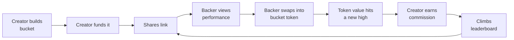
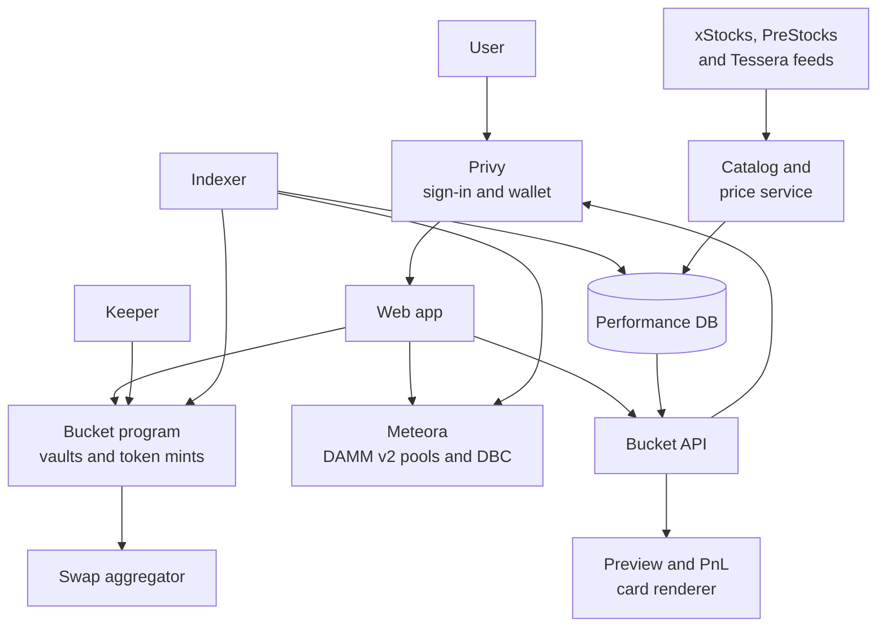

# Bucket — Product Spec

21 Sept 2026 · Oghenekparobor

## Summary

Bucket lets anyone bundle tokenized stocks into a named, weighted basket, put money into it in one tap, and earn a commission when other people invest through it and make gains.

A bucket is a public recipe: a list of stocks and their weights. Every bucket is also a token. Money going in buys the stocks into the bucket's vault and mints bucket tokens, so holding the token is holding a share of those stocks. Anyone with the link can see how it has performed, swap into it, and leave at any time. A leaderboard ranks buckets by return, so good pickers get found and paid. A bucket can also launch a creator coin on Meteora's bonding curve: a separate, demand-priced token for fans that is not backed by the stocks.

Bucket runs on Solana with tokenized public stocks from xStocks and pre-IPO company tokens from PreStocks and Tessera, is non-custodial, and prices everything in USD. People sign in with email, Google, Apple or X through Privy and get a self-custodial wallet automatically. It is entirely separate from Glance, and it makes everyone a portfolio manager.



The loop is self-feeding: performance earns ranking, ranking earns backers, backers earn the creator commission.

## Problem and opportunity

People with a good investing thesis have no way to package it, prove it, or get paid for it. People without a thesis either buy a generic index or copy stock tips from strangers with no track record.

- **Pickers** post ideas on X, Discord and newsletters that nobody can verify, and followers who profit pay them nothing. On Bucket, followers who profit pay the picker 20% of the profit, and pickers can share a PnL card of their bucket's growth on socials or save it as a picture.
- **Followers** cannot act on a multi-stock idea in one step. On Bucket they buy someone's whole bucket in one step and get notified when the picker changes their mind.
- **Funds** solve both, but need custodians, minimums and a fund vehicle. On-chain, a program holds the stocks and any holder can redeem their tokens for their share, so none of that is needed. Licensing is covered under risks.
- **The minimum investment is $1**, so anyone can start.

Tokenized stocks on Solana remove the plumbing problem. A basket is just a list of token mints and weights, swaps settle in seconds for cents, and every position is verifiable on-chain. That makes a track record something a program can compute rather than something a person claims.

## Goals and non-goals

### Goals

1. A creator can go from idea to a funded, shareable bucket in under 3 minutes.
2. A visitor arriving from a share link can understand the bucket and invest in under 2 minutes, with no wallet extension and one confirmation.
3. Every performance number shown is computed from on-chain data and is the same for everyone who looks.
4. Creators are paid only when the bucket token reaches a new high, and every fee is visible on-chain.
5. A creator can never withdraw, move or redirect a backer's money.

### Non-goals for v1

| Not doing | Why |
| --- | --- |
| Bucket tokens that are not fully backed | Every bucket token is backed by the stocks in its vault and redeemable at any time. The demand-priced creator coin is a separate token and is always labelled as unbacked. |
| Non-stock assets (SOL, memecoins, LP tokens) | Bucket is about companies, public and pre-IPO. A curated catalog also limits manipulation. |
| Building our own on-ramp or KYC | Card and bank funding come through Privy's funding providers, who run their own checks. Bucket only ever handles USDC. |
| Private or invite-only buckets | Public performance is the product. Private buckets weaken the leaderboard. |
| Leverage, shorting, options | Long-only keeps risk legible for backers and the fee model simple. |
| Social feed, comments, DMs | Distribution happens on X and chat apps through the share link. |

## Personas and core concepts

### Who uses it

| Persona | Who they are | What they want |
| --- | --- | --- |
| Creator | Has a thesis and an audience: a finance creator, an analyst, a sharp friend in a group chat | A verifiable track record, distribution, and income from being right |
| Backer | Has money and trust in a creator, but no time or confidence to pick stocks | One-tap exposure to someone else's thesis, with clear fees and a clean exit |
| Visitor | Arrives from a share link and is not signed in | Enough proof to decide whether to connect and invest |

A person can be all three. Every creator is also the first backer of their own bucket.

### Core concepts

| Concept | Definition |
| --- | --- |
| Bucket | A public recipe: name, thesis, 2 to 15 tokens from the catalog, public or pre-IPO, and a weight for each that sums to 100%. Stored on-chain. |
| Bucket token | The bucket's own token. Minted when money comes in and burned when it leaves, so every token is backed by stocks in the vault. Freely transferable and tradable. |
| Vault | The program-owned accounts that hold a bucket's stocks. Only the program can move them, and only to fill mints, pay redeems or rebalance. |
| Version | Each edit creates a new version of the recipe. Old versions stay visible forever. |
| Unit price | The value of one bucket token: vault value divided by tokens in supply. Starts at $100. Mints and redeems do not move it. |
| Pool price | What the bucket token trades at in its Meteora pool. Arbitrage against mint and redeem keeps it close to unit price. |
| Total backed | Current USD value of the stocks in the vault. |
| Commission | A flat 20% of the growth in unit price above its previous high, paid to the creator in newly minted bucket tokens. |
| Rebalance | One set of vault trades that moves every holder to the bucket's latest version at once. |
| Creator coin | An optional second token per bucket, launched on Meteora's Dynamic Bonding Curve. Priced by demand, not backed by the stocks, no claim on the vault. |

The key design choice is that a bucket is a pooled vault with its own token. The program holds the stocks, the creator steers the weights but can never withdraw them, and any holder can redeem tokens for their share of the vault at any time.

## User stories

### Creator

- As a creator, I want to search stocks and set a weight for each so that my bucket reflects my thesis exactly.
- As a creator, I want to fund my own bucket at creation so that backers can see I have money at risk.
- As a creator, I want to share a PnL card of my bucket's growth so that my results spread on socials.
- As a creator, I want to edit holdings and weights so that the bucket follows my thinking as it changes.
- As a creator, I want a link and a preview card so that I can share the bucket anywhere my audience is.
- As a creator, I want a dashboard of backers, total backed and commission earned so that I know what is working.
- As a creator, I want to close a bucket to new money so that I can retire a thesis without deleting its record.

### Backer

- As a backer, I want to see return, drawdown, holdings and edit history before investing so that I can judge the creator on facts.
- As a backer, I want to invest from as little as $1 in one step so that I do not place an order per stock.
- As a backer, I want to see the 20% commission and an example in dollars before I confirm so that fees never surprise me.
- As a backer, I want to swap into a bucket token from any Solana wallet or aggregator so that I can buy it wherever I already trade.
- As a backer, I want to be notified when a creator proposes an edit, before it takes effect, so that I can exit if I disagree.
- As a backer, I want to sell or redeem part or all of my bucket tokens for USDC at any time so that I am never locked in.
- As a backer, I want a portfolio view across all buckets I hold so that I see my total value, gains and fees paid.
- As a backer, I want to share or save a PnL card of my gains so that I can show my result and bring friends in.

### Visitor

- As a visitor, I want to open a bucket link without signing in so that I can evaluate before committing to anything.
- As a visitor, I want to browse the leaderboard by period so that I can find creators worth backing.
- As a visitor, I want to open a creator's profile so that I can see all their buckets, including the ones that lost money.

## Requirements

P0 is the smallest product where the full loop works: create, fund, share, back, measure, rank, pay.

### P0: Sign in and wallet

Privy handles sign-in and user wallets, so a first-time user needs no extension, no seed phrase and no SOL.

- [ ] Sign in with email, Google, Apple or X through Privy, or with an external Solana wallet such as Phantom, Solflare or Backpack
- [ ] A first sign-in by email or social creates a self-custodial Solana wallet automatically
- [ ] Browsing buckets, the leaderboard and profiles needs no sign-in. Sign-in is asked for only to create, invest or make a PnL card
- [ ] "Add funds" offers a deposit address with QR code, a transfer from an external wallet, and card or bank purchase of USDC through Privy's funding providers where available
- [ ] Every transaction is confirmed in an in-app sheet that states the action and the amount in USD
- [ ] Bucket sponsors network fees, so the user never needs to hold SOL
- [ ] A user can export their wallet key from settings at any time
- [ ] A user can link X, and a linked handle shows as verified on their buckets and profile
- [ ] A user who signed in with a wallet can add an email for notifications

### P0: Asset catalog

Buckets are built from one catalog that merges three Solana token issuers, so a creator can mix public stocks with pre-IPO companies such as SpaceX, OpenAI, Anthropic and Anduril.

| Source | What the token is | Feed |
| --- | --- | --- |
| xStocks | Tokenized public stocks and ETFs | xStocks token list, priced on-chain |
| [PreStocks](https://prestocks.com/api/prestocks) | Pre-IPO tokens backed 1:1 by SPV exposure to the private company. 8 companies as of 21 Sept 2026 | `prestocks.com/api/prestocks`: symbol, mint, token price, mark price, implied valuation, supply |
| [Tessera](https://docs.tessera.pe/) | T-Tokens: pre-IPO exposure structured as loan participation rights, tradable on Solana DEXs | `rest-api.tessera.pe/v1/public/token-details` |

- [ ] The catalog merges all three sources into one searchable list. Each entry carries ticker, company, mint, source, asset type (public stock, ETF or pre-IPO) and live on-chain price
- [ ] Catalog sync pulls every source at least hourly. A token that disappears from its source is flagged for review and blocked from new buckets, never silently dropped from existing ones
- [ ] Every token shows its source and a pre-IPO label in the builder, on the bucket page and on the confirmation screen
- [ ] Pre-IPO tokens show both the on-chain token price and the issuer's mark price, because the two can sit far apart. On 21 Sept 2026 the SpaceX PreStocks token traded near $119 against a mark near $154
- [ ] Unit price, returns and commission always use the on-chain token price, since that is what backers actually trade at
- [ ] Only tokens above the liquidity floor can be added. Each pre-IPO token is capped at 25% of a bucket, against 50% for public stocks
- [ ] A bucket holding pre-IPO tokens states on its confirmation screen that these are not shares: PreStocks are SPV-backed exposure and Tessera tokens are loan participation rights

### P0: Create a bucket

The creator names the bucket, writes a thesis of up to 280 characters, picks 2 to 15 stocks from the curated catalog, and sets weights.

- [ ] Stock search returns results by ticker or company name with live price
- [ ] Weights are whole percentages, each between 2% and 50%, or 25% for a pre-IPO token, and must sum to 100% before the creator can continue
- [ ] An "equal weight" action splits 100% evenly across the chosen stocks
- [ ] Commission is fixed at 20% of backers' realised gains on every bucket. The creator does not set it
- [ ] Creator must deposit at least $25 of their own money in the same flow. A bucket with no creator money cannot be published
- [ ] Publishing writes the recipe on-chain, creates the bucket's token mint and vault, mints the creator's first tokens from their deposit, opens the bucket's Meteora pool, and returns a share link
- [ ] A wallet can own at most 5 active public buckets

### P0: Invest in a bucket

- [ ] Backer enters a USD amount, minimum $1, funded from USDC in their Bucket wallet or a connected external wallet
- [ ] The app quotes two routes and uses the cheaper: minting new tokens at unit price, or swapping in the bucket's Meteora pool
- [ ] Minting buys every stock into the vault in the vault's current proportions and issues tokens pro rata, so the backer pays unit price plus swap costs
- [ ] The confirmation screen shows tokens received, the effective price against unit price, estimated swap cost, and how the 20% commission works
- [ ] One confirmation completes it. A mint that needs several swap transactions shows "filling" and delivers tokens as each part completes
- [ ] If a leg fails or exceeds 1% slippage, the unfilled USDC goes back to the backer
- [ ] Amounts too small for every stock leg to trade are routed to the Meteora pool

**Account rent.** A backer now holds one bucket token, not a token account per stock. They pay the one-time rent for that single account, about 0.002 SOL, charged in USDC and refunded if they close the account. The vault's own stock accounts are paid for by the creator when the bucket is published or edited.

### P0: Sell or redeem

- [ ] A holder can exit any amount at any time by the cheaper of two routes: redeeming tokens for their share of the vault, sold to USDC, or swapping in the Meteora pool
- [ ] Redeem burns the tokens and sells the holder's pro-rata slice of every stock. No lock-up and no exit fee
- [ ] The exit screen shows proceeds and the effective price against unit price before confirmation
- [ ] Redeem works even if the bucket is closed, the creator is inactive, the Meteora pool is empty, or the Bucket web app is offline
- [ ] Bucket tokens can be held in any Solana wallet, transferred, and traded outside Bucket

### P0: Edit a bucket

- [ ] Creator can add stocks, remove stocks and change weights, under the same rules as creation
- [ ] Each edit creates a new version with a timestamp and an optional note of up to 140 characters
- [ ] An edit takes effect 24 hours after it is submitted. During that window the bucket page shows the pending change to everyone
- [ ] At most one edit per 7 days
- [ ] When an edit takes effect, a keeper rebalances the vault once for all holders, within a slippage bound on every trade
- [ ] A holder who disagrees with a pending edit can redeem or sell during the 24-hour window
- [ ] Every backer is notified when an edit is proposed and again when it takes effect: in the app, and by email or Telegram if they have added one
- [ ] Name and thesis are editable. Performance history is never editable or resettable

### P0: Performance

- [ ] Every bucket page shows unit price chart, return over 7 days, 30 days, 90 days and since creation, max drawdown, total backed, number of holders, bucket age, and the pool price with its premium or discount to unit price
- [ ] Holdings table shows each stock, target weight, and its contribution to return
- [ ] Version history lists every edit with before and after weights
- [ ] A holder sees their tokens, current value, and gain in USD and percent against what they paid through Bucket

### P0: Leaderboard

- [ ] Ranks public buckets by return for a chosen period: 7 days, 30 days, 90 days, all time. Default is 30 days
- [ ] Each row shows rank, bucket name, creator, return, max drawdown, total backed, and backers
- [ ] Only eligible buckets are ranked. Eligibility rules are in the methodology section
- [ ] Updates at least once per hour

### P0: Share link

- [ ] Every bucket has a permanent URL of the form `bucket.xyz/b/<slug>`
- [ ] The page is fully readable without signing in
- [ ] The link renders a preview card on X, WhatsApp, Telegram and iMessage showing name, creator, 30-day return and top 3 holdings
- [ ] A share button copies the link and offers native share on mobile
- [ ] A creator or backer can generate a PnL card for a bucket showing bucket name, creator, period, percent return, and a QR code and short link back to the bucket
- [ ] The PnL card can be saved as an image or shared straight to X, WhatsApp and Telegram. A backer's card shows percent gain by default, and dollar amounts only if they switch them on

### P1: Creator coin

A bucket can have one creator coin, launched on Meteora's [Dynamic Bonding Curve](https://docs.meteora.ag/developer-guides/dbc). It lets fans back the creator directly. Its price follows demand along a curve, it is not backed by the stocks, and it gives no claim on the vault.

- [ ] A creator can launch one coin per bucket once the bucket is leaderboard-eligible
- [ ] Bucket is the DBC partner. One Bucket-owned config key fixes the curve, USDC as quote token, fees, and migration to a DAMM v2 pool for every creator coin. Creators cannot change it
- [ ] The coin trades on its bonding curve from launch and graduates to a DAMM v2 pool when the quote threshold is reached
- [ ] DBC trading fees are split between Bucket as partner and the creator, 50/50 as a starting proposal
- [ ] Wherever it appears, the creator coin carries an "unbacked" label and one line saying its price follows demand, not the stocks
- [ ] The creator coin never counts toward a holder's bucket value, a bucket's returns, or leaderboard ranking

### P1: fast follows

- Creator profile page with all buckets, combined total backed, and lifetime record, including closed buckets
- Creator dashboard: backers over time, commission earned, link clicks to deposits
- Notifications for completed rebalances and commission paid
- Solana Blinks so a backer can invest from inside an X post
- Recurring deposits, weekly or monthly
- Risk-adjusted leaderboard tab
- Referral attribution so a non-creator who shares a link earns a slice of platform fees

### P2: design for, do not build

- Aggregator integration so Jupiter can route through mint and redeem as well as the pool
- Bucket tokens as collateral in lending protocols
- Buckets that hold other buckets

## Commission model

Commission is 20% of the growth in a bucket token's unit price above its previous high, taken at the bucket level. Bucket tokens trade freely, so there is no per-holder cost basis to charge against, and the fee is built into the token instead. No management fee, no entry fee, and no fee while the bucket is below its high.

### Rules

1. Commission is a flat 20% on every bucket. Creators cannot change it.
2. Each bucket records a high-water mark: the unit price at which commission was last taken. It starts at $100.
3. Commission is settled at least daily, and before every mint and redeem, so nobody enters or leaves ahead of a fee.
4. At settlement, if unit price is above the high-water mark, commission is 20% of the excess times tokens in supply. The high-water mark then moves up to the new unit price.
5. Commission is paid by minting new bucket tokens worth that amount. This dilutes every holder equally and sells no stocks.
6. The platform keeps 20% of each commission. The creator receives 80% as bucket tokens, which they can hold, redeem or sell.
7. The creator's own tokens are treated like any other holder's.
8. If unit price falls, commission already taken is not refunded, and none is taken again until the price passes the high-water mark.
9. Known trade-off: someone who buys below the high-water mark pays no commission on the climb back to it. This is standard for high-water-mark fees and keeps the token fungible.

```latex
\text{commission} = 0.20 \times \max\left(0,\; U - H\right) \times S
```

Here U is the unit price, H the high-water mark, and S the tokens in supply.

### Worked example

| Step | Unit price | High-water mark | Tokens in supply | Commission | Creator gets | Platform gets |
| --- | --- | --- | --- | --- | --- | --- |
| Launch with a $100,000 vault | $100.00 | $100.00 | 1,000.00 | | | |
| Stocks rise 25% | $125.00 | $100.00 | 1,000.00 | $5,000 | $4,000 | $1,000 |
| After fee tokens are minted | $120.00 | $120.00 | 1,041.67 | | | |
| Stocks fall 10% | $108.00 | $120.00 | 1,041.67 | $0 | $0 | $0 |
| Stocks recover | $130.00 | $120.00 | 1,041.67 | $2,083 | $1,667 | $417 |
| After fee tokens are minted | $128.00 | $128.00 | 1,057.94 | | | |

A holder from launch is up 20% after the first fee and 28% after the second.

### Platform revenue

Three lines, all proposals to confirm: the 20% share of commissions above, a 0.20% fee on the USD value of mints and redeems, and the partner share of trading fees on creator coins. The second line means the platform earns even in flat markets, when commissions are zero.

## Performance and leaderboard methodology

A bucket's performance is the change in its unit price: vault value divided by tokens in supply. Mints and redeems are proportional, so money flowing in or out does not move it, and the number is the same for every viewer. Returns are shown after commission, because that is what a holder earns.

### Unit price

- Starts at $100 when the bucket is published.
- Recomputed at least hourly from the vault's holdings and each token's on-chain price.
- An edit rebalances the vault. The unit price carries on from its last value, and the swap costs of the rebalance show up in it.
- The pool price can sit at a premium or discount to unit price. Both are shown, and returns always use unit price.
- A holder's personal return depends on the price they paid, so it is shown separately from the bucket's.

### Leaderboard eligibility

| Rule | Threshold | Guards against |
| --- | --- | --- |
| Bucket age | At least 14 days, and at least as old as the period being ranked | Lucky new buckets topping the board |
| Creator's own money | At least $25 held continuously | Zero-risk paper portfolios |
| Holdings | Every token above a minimum liquidity in the catalog | Returns that nobody could actually have traded |
| Active buckets per wallet | 5 | Spraying many buckets and promoting the winner |
| Status | Public and open | Closed buckets stay on profiles, not on the board |

### Anti-gaming

- **Edit front-running.** A creator could buy a thin stock, add it to a bucket, and sell into the vault's rebalance. The 24-hour public delay, the liquidity floor, the 50% weight cap and the 7-day edit limit each reduce the payoff.
- **Survivorship.** Creator profiles show every bucket a wallet has made, including closed and losing ones. P1 adds a combined record per creator.
- **Sybil creators.** Wallet limits are easy to dodge with new wallets. The $25 stake and 14-day wait make each extra bucket cost money and time. Creators who link X through Privy get a verified handle on their buckets, which gives backers an identity signal.
- **Return chasing.** Ranking by raw return rewards concentrated bets. Max drawdown sits beside return on every row, and P1 adds a risk-adjusted tab.

## Architecture

One Anchor program holds recipes, vaults and bucket token mints. Meteora provides the pool each bucket token trades in and the bonding curve for creator coins. An off-chain service computes performance and runs the keeper. The web app is the only client in v1, with Privy handling sign-in and user wallets.



The program is the source of truth for money and recipes. Everything in the database can be rebuilt from chain history.

### Sign-in and wallets

Privy owns identity and user wallets. Bucket never holds a user's key, and the on-chain program does not know Privy exists.

- Email and social sign-ins get a [Privy embedded Solana wallet](https://docs.privy.io/wallets/overview/solutions/user-wallets). Keys are sharded so that neither Privy nor Bucket holds a complete key, and the user can export theirs.
- External wallets also sign in through Privy, so every user has one Privy user ID with linked wallets, email and X handle.
- The Bucket API verifies the Privy access token on each request and maps the user ID to the wallet address that holds their bucket tokens.
- The program deals only in wallet addresses. An exported key can create, mint and redeem with no Privy service involved.
- The keeper does not use Privy session signers or delegated signing. Its authority comes from the program and is limited to filling mints, settling commission and rebalancing vaults among the allowed mints, so the promise that nobody else can move a backer's money is enforced on-chain rather than by a vendor setting.
- Network fees are sponsored through Privy's gas management on Solana. The keeper pays its own fees. Rent for a new holder's bucket token account is fronted by the fee payer and recovered from their first mint in USDC.

### On-chain accounts

| Account | Seeds | Holds |
| --- | --- | --- |
| Bucket | creator, bucket id | Creator, status, token mint, high-water mark, active version number, pending version and its effective time, target weights as mint and weight pairs |
| Vault | bucket | Program-owned token accounts for each holding plus USDC |
| Bucket token mint | bucket | The program is the only mint authority. Supply changes only through mint, redeem and commission |
| Fee accounts | creator, platform | Bucket tokens received as commission |
| Config | global | Allowed mints with source and asset type, commission rate, platform fee rates, fee wallet, keeper authority, limits |

### Instructions

| Instruction | Signer | What it does |
| --- | --- | --- |
| `create_bucket` | Creator | Validates holdings against the allowed mints and weight rules, writes version 1, creates the token mint and vault |
| `propose_edit` | Creator | Stores a pending version with an effective time 24 hours out. Rejects if the last edit was under 7 days ago |
| `activate_edit` | Anyone | After the effective time, promotes the pending version to active |
| `close_bucket` | Creator | Blocks new mints. Redeem stays open |
| `mint` | Backer | Settles commission, takes USDC, buys every holding in the vault's current proportions, and mints tokens pro rata to what was added |
| `fill` | Keeper or backer | Completes the swaps of a mint that spans several transactions, within a slippage bound |
| `redeem` | Holder | Settles commission, burns tokens, sells the pro-rata slice of every holding and pays USDC |
| `rebalance` | Keeper | Trades the vault toward the active weights, within a slippage bound, only among allowed mints |
| `settle_commission` | Anyone | Values the vault, and if unit price is above the high-water mark mints fee tokens to the creator and platform |

### Notes for engineering

- Mint and redeem are proportional, so they need no price oracle. A mint adds every holding in the vault's current ratio and issues tokens pro rata. A redeem removes the same slice.
- `settle_commission` is the one instruction that needs on-chain prices. Public stocks can use an oracle feed. Pre-IPO tokens have none, so they need a time-weighted DEX price with bounds. This is the riskiest piece of the program.
- A 15-stock mint will not fit its swaps in one transaction. Mint is one approval, then `fill` runs as several keeper transactions and tokens are issued as each part completes.
- The keeper can only call `fill`, `rebalance` and `settle_commission`, and only to trade between USDC and the bucket's own mints inside the vault. It has no path to move funds out. Neither does the creator.
- `redeem` must never depend on the keeper, the API, the creator or Meteora.
- Each bucket gets a Meteora DAMM v2 pool of bucket token against USDC when it is published. Arbitrage between the pool and mint and redeem keeps the pool price near unit price.
- Creator coins use Meteora's DBC program through its [TypeScript SDK](https://github.com/MeteoraAg/dynamic-bonding-curve-sdk), with one Bucket-owned partner config. DBC creates the coin's mint itself and cannot take an existing token, which is why the creator coin cannot be the stock-backed token.
- Bucket has its own program, stock catalog, price service and swap routing. Nothing is shared with Glance. The allowed mints are a liquidity-filtered list drawn from xStocks, PreStocks and Tessera, and Config records each mint's source and asset type so the program can enforce the pre-IPO weight cap.

## Risks, trust and compliance

Regulation is the largest risk, ahead of anything technical. A person who steers other people's money and takes a share of profit looks like an investment adviser or fund manager in most jurisdictions, and a pooled vault that issues its own token makes that reading stronger.

| Risk | Why it matters | Mitigation |
| --- | --- | --- |
| Creator treated as an unlicensed adviser or manager | Performance fees and automatic rebalancing are regulated activities in many markets | Legal review before mainnet. Program-enforced limits on what a creator can do. Geo-restrictions matching the token issuers' own |
| Platform treated as operating a collective investment scheme | A pooled vault that issues tokens is a fund in structure, so this is now the most likely regulatory reading. It could require licensing or force a shutdown | Same as above, plus clear terms that Bucket provides software and does not manage money |
| Creator manipulates a thin stock through followers | Direct harm to backers | Liquidity floor, weight cap, 24-hour delay, edit limit, monitoring of creator wallet trades around edits |
| Backers read past return as a promise | Complaints and reputational damage | Drawdown next to every return figure, standard past-performance notice, dollar fee example before every deposit |
| Program bug loses funds | Fatal to trust | External audit before mainnet, caps on vault size at launch, redeem path kept minimal |
| Keeper outage | Mints stall and the vault drifts from the recipe | Anyone can call `fill` and `settle_commission`, and `redeem` never needs the keeper |
| Thin liquidity on tokenized stocks | High slippage on deposits into long-tail names | Liquidity floor on allowed mints, slippage bound per leg, unfilled slices stay in USDC |
| Token issuer events: splits, dividends, delistings | Unit price and vault holdings could break | Follow the issuer's handling. A delisted token is force-removed by an admin edit with the same 24-hour notice |
| Dependence on Privy for sign-in and embedded wallets | An outage or a change in terms blocks sign-in and signing for users without an external wallet | Key export from day one, external wallet sign-in supported, and no Privy dependency in the program, so an exported key can always redeem |
| Pre-IPO tokens are thinly traded and priced off private marks | The token price can sit far from the issuer's mark, one large flow can move it, and the tokens are not shares | Liquidity floor, 25% weight cap per pre-IPO token, both prices shown, returns measured on the on-chain price, plain-language notice before investing |
| Pool price drifts from unit price | With thin pool liquidity a backer can overpay, or sell below what the stocks are worth | The app always quotes mint and redeem beside the pool and picks the cheaper. Premium or discount shown on every bucket page |
| Commission valuation is manipulated | Pushing a thin token's price up just before settlement mints fee tokens the creator did not earn | Time-weighted prices with bounds, liquidity floor, pre-IPO weight cap, settlement at unpredictable times |
| Creator coin is mistaken for the backed token, or read as a security | Buyers lose money on a demand-priced coin they thought was backed, and regulators see a second unregistered instrument | Unbacked label everywhere, kept out of bucket value and returns, P1 not P0, own legal review before launch |

## Success metrics

The one number that proves the product works is the share of buckets that attract at least one backer who is not the creator. Targets below are starting hypotheses for the first 90 days on mainnet, to be revised after the first month of real data.

### Leading, reviewed weekly

| Metric | Target | Why it matters |
| --- | --- | --- |
| Bucket creation completion: started to published | 60% | Tests the builder and the $25 stake |
| Median time from share link open to first deposit | Under 3 minutes | Tests the visitor-to-backer path |
| Share link visits that sign in | 25% | Tests whether the page earns trust |
| Signed-in visitors who deposit | 25% | Tests funding, the confirmation screen and fee clarity |
| Deposits filled completely within 60 seconds | 95% | Tests swap reliability |

### Lagging, reviewed monthly

| Metric | Target | Why it matters |
| --- | --- | --- |
| Buckets with at least one outside backer | 25% | The loop closes |
| New backers arriving through a share link | 50% | Creators are the distribution channel |
| Backers still holding after 30 days | 60% | Backing is investing, not a one-day trade |
| Creators who have earned any commission | 10% | The incentive is real |
| Total backed | $1M | Scale check for platform revenue |
| Median gap between pool price and unit price | Under 1% | The token really tracks its stocks |

## Open questions

### Blocking

- [ ] **Legal:** A pooled vault that issues tokens is a fund in structure, and the creator coin may be read as a security. Which jurisdictions can Bucket serve, what licence or exemption applies, and can creators earn commission there?
- [ ] **Product:** Does the creator keep the full 20%, or does the platform take a share of it? This spec assumes the platform keeps 20% of each commission, plus a 0.20% fee on mints and redeems.
- [ ] **Engineering:** How does `settle_commission` value the vault on-chain, especially pre-IPO tokens that have no oracle?
- [ ] **Engineering:** How much seed liquidity does a bucket's Meteora pool need before swaps are usable, and who provides it: the creator, the platform, or both?
- [ ] **Product:** One creator coin per bucket, or one per creator? Should part of the commission buy the coin back? That would tie it to performance, and also make it look more like a security.

### Non-blocking

- [ ] **Engineering:** Which price source sets the unit price outside US market hours, when on-chain prices can drift from the last close?
- [ ] **Engineering:** What liquidity floor qualifies a token for buckets, and how many xStocks, PreStocks and Tessera tokens pass it today?
- [ ] **Engineering:** xStocks, PreStocks and Tessera tokens exist on mainnet only. Does the devnet preview use mock mints with mirrored prices?
- [ ] **Engineering:** Tessera's token-details endpoint returned a server error when checked for this spec. What are its fields, rate limits and uptime, and do we need a key?
- [ ] **Legal:** PreStocks and Tessera tokens are not shares, and each issuer has its own terms and restricted countries. Do buckets that hold them need tighter geo-restrictions than xStocks-only buckets?
- [ ] **Product:** Is 25% the right weight cap for a pre-IPO token?
- [ ] **Product:** Which of Privy's funding methods work in our launch countries, and what limits and checks do those providers apply?
- [ ] **Product:** Do we sponsor network fees for every transaction forever, or cap sponsorship per user?
- [ ] **Product:** Linking X through Privy is one tap. Should a linked X account be required to appear on the leaderboard?
- [ ] **Product:** What is the smallest amount that mints through the vault rather than being routed to the pool?
- [ ] **Design:** Email from sign-in is the default notification channel. What reaches backers who signed in with a wallet and added no email?
- [ ] **Data:** Is 14 days the right minimum age, or does it let short lucky streaks through?

## Phasing

Three phases, each ending in something a real user can do end to end. No dates are set yet.

| Phase | Scope | Done when |
| --- | --- | --- |
| 1. Devnet preview | Privy sign-in with embedded wallets, catalog from xStocks, PreStocks and Tessera, create with token mint and vault, mint and redeem with keeper fill, commission settlement, bucket page with unit price chart, basic leaderboard, share link with preview card and PnL card | A creator builds a bucket, a second wallet mints tokens from the link, redeems at a gain, and the creator receives commission tokens |
| 2. Mainnet v1 | Card and bank funding through Privy, sponsored fees, edits with 24-hour delay, backer notifications and vault rebalance, a Meteora pool per bucket, eligibility rules, vault caps, version history, portfolio view, audit, legal sign-off, geo-restrictions | All P0 acceptance criteria pass on mainnet with capped deposits |
| 3. Growth | Creator coins on Meteora DBC, creator profiles and dashboard, payout notifications, Blinks, recurring deposits, risk-adjusted ranking, referrals | P1 list shipped and the lagging metrics are being tracked against target |

Phase 1 builds everything from scratch: the program, the keeper, the stock catalog and price service, the performance calculator and the web app. Edits are deliberately left to phase 2: they carry most of the manipulation and regulatory risk, and the core loop can be proven without them.