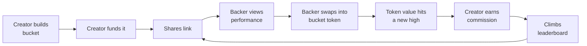

# Bucket Project Overview

24 Sept 2026 · Oghenekparobor

## Name

**Bucket**

## Tagline

**Turn your stock picks into a token anyone can buy, and get paid when it wins.**

## Short description

Bucket lets anyone bundle tokenized stocks into a named, weighted basket that is also a fully backed token on Solana. Anyone with the link can invest from $1 in one tap and leave at any time, with no wallet extension and no SOL. Creators earn 20% of gains above the bucket's previous high, so good stock pickers get found, verified on-chain, and paid.

## Full description

Bucket makes everyone a portfolio manager. A creator picks 2 to 15 tokenized stocks, sets a weight for each, and publishes the recipe as a bucket. Every bucket is also a token: money going in buys the stocks into a program-owned vault and mints bucket tokens, so holding the token is holding a share of those stocks.

### Who it is for

- **Creators** have a thesis and an audience: a finance creator, an analyst, or a sharp friend in a group chat. They get a verifiable track record, a shareable link, and income from being right.
- **Backers** have money and trust in a creator, but no time or confidence to pick stocks. They get one-tap exposure to a whole basket, clear fees, and a clean exit.
- **Visitors** arrive from a share link. They can read every bucket, the leaderboard and creator profiles without signing in.

A person can be all three. Every creator is also the first backer of their own bucket.

### How it works

The loop feeds itself: performance earns ranking, ranking earns backers, and backers earn the creator commission.

- **Building.** A creator names the bucket, writes a thesis of up to 280 characters, picks stocks from a curated catalog, and sets whole-percent weights that sum to 100%. Publishing writes the recipe on-chain, creates the token mint and vault, and returns a share link. The creator must put in at least $25 of their own money, so backers see money at risk.
- **Investing.** A backer enters a USD amount, minimum $1. The program buys every stock into the vault in its current proportions and issues bucket tokens pro rata at the unit price. Network fees are sponsored, so the backer never needs SOL.
- **Leaving.** A holder can redeem any amount at any time. Redeem burns the tokens and sells the holder's slice of every stock for USDC, with no lock-up and no exit fee. It works even if the bucket is closed, the creator is gone, or the Bucket app is offline.
- **Editing.** A creator can change holdings and weights at most once every 7 days. Each edit is public for 24 hours before it takes effect, so backers who disagree can exit first. A keeper then rebalances the vault once for every holder.
- **Performance.** A bucket's return is the change in its unit price: vault value divided by tokens in supply. Mints and redeems do not move it, so every number is computed from chain data and is the same for everyone. A leaderboard ranks eligible buckets by return over 7, 30 and 90 days and all time.

### Commission

Creators earn 20% of the growth in unit price above its previous high, the high-water mark. Commission is paid in newly minted bucket tokens, which dilutes every holder equally and sells no stocks. There is no management fee, no entry fee, and no fee while the bucket sits below its high. The platform keeps 20% of each commission and the creator receives 80%.

### Safety by construction

The program holds the stocks, and only the program can move them. The creator steers the weights but can never withdraw, move or redirect a backer's money. The keeper can only fill mints, rebalance among the allowed mints, and settle commission. Every fee is visible on-chain.

### Asset catalog

Buckets draw from one catalog that merges three Solana issuers: xStocks for tokenized public stocks and ETFs, and PreStocks and Tessera for pre-IPO companies such as SpaceX, OpenAI and Anthropic. Only tokens above a liquidity floor can be added. Each pre-IPO token is capped at 25% of a bucket, against 50% for a public stock, and is labelled as not shares with both its on-chain price and the issuer's mark shown.

### What it is built with

| Layer | What it is |
| --- | --- |
| On-chain | `bucket_vault`, an Anchor program on Solana holding recipes, vaults, bucket token mints and commission logic. Swaps route through Jupiter on mainnet and a mock venue on devnet. |
| SDK | `@bucket/sdk` in TypeScript: PDA helpers, instruction and flow builders, an event parser, and math that mirrors the program |
| Backend | Fastify and Postgres API with Privy auth and sponsored transactions, catalog and price service, indexer, performance and leaderboard jobs, keeper, and a preview and PnL card renderer |
| Web | Next.js 15 and React 19 app: leaderboard, bucket page, builder, invest and redeem, portfolio, creator dashboard, PnL card |
| Pools | A Meteora DAMM v2 pool per bucket token, and Meteora's Dynamic Bonding Curve for optional creator coins in a later phase |

Sign-in is by email, Google, Apple or X through Privy, which creates a self-custodial wallet automatically, or with an external Solana wallet such as Phantom. Bucket never holds a user's key, and a user can export it at any time.

### Where it stands

Phase 1, the devnet preview, is built and verified end to end on localnet: the program passes 77 LiteSVM tests, and the full loop of create, invest, gain, redeem and commission runs through the real stack. Mainnet v1 waits on a Privy app, an external audit, and legal review, since a pooled vault that issues tokens can be read as a fund.
